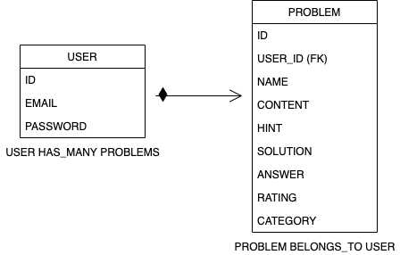

# What's Your Problem?

For some students word problems can be a real drag, but are essential for a childs critical thinking abilities. "What's Your Problem?" is designed to help students become more excited about solving word problems.

## ERD



## User stories

- As a user I would like to search for a word problem.
- As a user I would like to search by category to find a word problem.
- As a user I would like to search by rating to find a word problem.
- As a user I would like to search by difficulty level to find a word problem.
- As a user I would like to create my own word problem from scratch.
- As a user I would like to create my own word problem from a template.
- As a user I would like to update a word problem I created.
- As a user I would like to share/ print my word problem.
- As a user I would like to have a space to work on my word problem.

## Links

[Deployed API](https://damp-escarpment-10974.herokuapp.com/)

[Deployed Client](https://gmorse19.github.io/whats-your-problem-client/)

[Client Repo](https://github.com/GMorse19/whats-your-problem-client)

## Dependencies

Install with `bundle install`.

-   [`rails-api`](https://github.com/rails-api/rails-api)
-   [`rails`](https://github.com/rails/rails)
-   [`active_model_serializers`](https://github.com/rails-api/active_model_serializers)
-   [`ruby`](https://www.ruby-lang.org/en/)
-   [`postgres`](http://www.postgresql.org)

### Problems Endpoints and Curl Scripts
| Verb   | URI Pattern            | Controller#Action |
|--------|------------------------|-------------------|
| GET   | `/problems`  | `problems#index` |
| GET   | `/problems/:id`  | `problems#show`  |
| POST   | `/problems-create`             | `problems#create`    |
| PATCH  | `/problems-update`     | `problems#update`  |
| DELETE | `/problems/:id`        | `problems#destroy`   |

#### GET /problems

Request:

```sh
curl "http://localhost:4741/problems" \
  --include \
  --request GET \

```

#### GET /problems/:id

Request:

```sh
curl "http://localhost:4741/problems/${ID}" \
  --include \
  --request GET \
  --header "Content-Type: application/json" \
  --header "Authorization: Token token=${TOKEN}" \

```

#### POST /problems

Request:

```sh
curl "http://localhost:4741/problems" \
  --include \
  --request POST \
  --header "Content-Type: application/json" \
  --header "Authorization: Token token=${TOKEN}" \
  --data '{
    "problem": {
      "name": "'"${NAME}"'",
      "content": "'"${CONTENT}"'",
      "hint": "'"${HINT}"'",
      "solution": "'"${SOLUTION}"'",
      "answer": "'"${ANSWER}"'",
      "category": "'"${CAT}"'",
      "rating": "'"${RATING}"'"
    }
  }'

```
#### PATCH /problems/:id

Request:

```sh
curl "http://localhost:4741/problems/${ID}" \
  --include \
  --request PATCH \
  --header "Content-Type: application/json" \
  --header "Authorization: Token token=${TOKEN}" \
  --data '{
    "problem": {
      "name": "'"${NAME}"'",
      "content": "'"${CONTENT}"'",
      "hint": "'"${HINT}"'",
      "solution": "'"${SOLUTION}"'",
      "answer": "'"${ANSWER}"'",
      "category": "'"${CAT}"'",
      "rating": "'"${RATING}"'"
    }
  }'

```

#### DELETE /problems/:id

Request:

```sh
curl "http://localhost:4741/problems/${ID}" \
  --include \
  --request DELETE \
  --header "Authorization: Token token=${TOKEN}" \

```


### Authentication Endpoints and Curl Scripts

| Verb   | URI Pattern            | Controller#Action |
|--------|------------------------|-------------------|
| POST   | `/sign-up`             | `users#signup`    |
| POST   | `/sign-in`             | `users#signin`    |
| PATCH  | `/change-password`     | `users#changepw`  |
| DELETE | `/sign-out`        | `users#signout`   |

#### POST /sign-up

Request:

```sh
curl http://localhost:4741/sign-up \
  --include \
  --request POST \
  --header "Content-Type: application/json" \
  --data '{
    "credentials": {
      "email": "'"${EMAIL}"'",
      "password": "'"${PASSWORD}"'",
      "password_confirmation": "'"${PASSWORD}"'"
    }
  }'
```

```sh
EMAIL=ava@bob.com PASSWORD=hannah curl-scripts/auth/sign-up.sh
```

Response:

```md
HTTP/1.1 201 Created
Content-Type: application/json; charset=utf-8

{
  "user": {
    "id": 1,
    "email": "ava@bob.com"
  }
}
```

#### POST /sign-in

Request:

```sh
curl http://localhost:4741/sign-in \
  --include \
  --request POST \
  --header "Content-Type: application/json" \
  --data '{
    "credentials": {
      "email": "'"${EMAIL}"'",
      "password": "'"${PASSWORD}"'"
    }
  }'
```

```sh
EMAIL=ava@bob.com PASSWORD=hannah curl-scripts/auth/sign-in.sh
```

Response:

```md
HTTP/1.1 200 OK
Content-Type: application/json; charset=utf-8

{
  "user": {
    "id": 1,
    "email": "ava@bob.com",
    "token": "BAhJIiVlZDIwZTMzMzQzODg5NTBmYjZlNjRlZDZlNzYxYzU2ZAY6BkVG--7e7f77f974edcf5e4887b56918f34cd9fe293b9f"
  }
}
```

#### PATCH /change-password

Request:

```sh
curl --include --request PATCH "http://localhost:4741/change-password" \
  --header "Authorization: Token token=$TOKEN" \
  --header "Content-Type: application/json" \
  --data '{
    "passwords": {
      "old": "'"${OLDPW}"'",
      "new": "'"${NEWPW}"'"
    }
  }'
```

```sh
OLDPW='hannah' NEWPW='elle' TOKEN='BAhJIiVlZDIwZTMzMzQzODg5NTBmYjZlNjRlZDZlNzYxYzU2ZAY6BkVG--7e7f77f974edcf5e4887b56918f34cd9fe293b9f' sh curl-scripts/auth/change-password.sh
```

Response:

```md
HTTP/1.1 204 No Content
```

#### DELETE /sign-out

Request:

```sh
curl http://localhost:4741/sign-out \
  --include \
  --request DELETE \
  --header "Authorization: Token token=$TOKEN"
```

```sh
TOKEN='BAhJIiVlZDIwZTMzMzQzODg5NTBmYjZlNjRlZDZlNzYxYzU2ZAY6BkVG--7e7f77f974edcf5e4887b56918f34cd9fe293b9f' sh curl-scripts/auth/sign-out.sh
```

Response:

```md
HTTP/1.1 204 No Content
```


## [License](LICENSE)

1.  All content is licensed under a CC­BY­NC­SA 4.0 license.
1.  All software code is licensed under GNU GPLv3. For commercial use or
    alternative licensing, please contact legal@ga.co.
